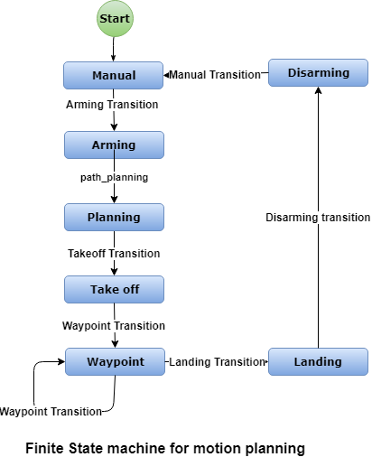

## Project: 3D Motion Planning

---

# Required Steps for a Passing Submission:
1. Load the 2.5D map in the colliders.csv file describing the environment.
2. Discretize the environment into a grid or graph representation.
3. Define the start and goal locations.
4. Perform a search using A* or other search algorithm.
5. Use a collinearity test or ray tracing method (like Bresenham) to remove unnecessary waypoints.
6. Return waypoints in local ECEF coordinates (format for `self.all_waypoints` is [N, E, altitude, heading], where the drone’s start location corresponds to [0, 0, 0, 0].
7. Write it up.
8. Congratulations!  Your Done!

## [Rubric](https://review.udacity.com/#!/rubrics/1534/view) Points
### Here I will consider the rubric points individually and describe how I addressed each point in my implementation.  

---
### Writeup / README

#### 1. Provide a Writeup / README that includes all the rubric points and how you addressed each one.  You can submit your writeup as markdown or pdf.  

You're reading it! Below I describe how I addressed each rubric point and where in my code each point is handled.

### Explain the Starter Code

#### 1. Explain the functionality of what's provided in `motion_planning.py` and `planning_utils.py`

`motion_planning.py` implementes a state machine as shown below .  
`motion_planning.py` adds a new state `PLANNING` to the states used in `backyard_flyer.py`, this is introduced between `ARMING` and `TAKEOFF` in the finite state machine.  When the transition happens between `ARMING` and `PLANNING` in the state_calback() method in [motion_planning.py:61-72](./motion_planning.py#L61-L72) path_plan() method is called to calculate the waypoints needed for the drone to reach its goal.

Each state in the finite state machine is represented by a node, edges show the transistions from one state to another. The states defined in lines [motion_planning.py:15-22](./motion_planning.py#L15-L22) is the status of the drone that is waiting to execute a transition. 

States | Description
------- | -----------
MANUAL | This is the initial state of the drone, where the drone could be manually moved
ARMING | In this state the drone is armed and taken control by the module for path planning to reach a goal
PLANNING | Drone is in planning state and finds the waypoints to reach the goal
TAKEOFF | Drone takes off to go to next way point
WAYPOINT | Drone is at a way point
LANDING | Drone lands at a waypoint or goal
DISARMING | Drone is disarmed to release control

The transitions which are set of actions from one state to another are done in lines [motion_planning.py:61-72](./motion_planning.py#L61-L72) and their corresponding implementations are in lines [motion_planning.py:74-107](./motion_planning.py#L74-L107).

Transition | Description
------- | -----------
Manual | Drone is transitioned from DISARMING state to MANUAL state
Arming | Drone is transitioned from MANUAL state to ARMING state, the drone is armed and taken control by the module
Take off | Drone is transitioned from PLANNING state to TAKEOFF state with drone going to target altitude
Waypoint | Pops the next waypoint from the stack and sets the drone target to go to next waypoint
Landing | Drone reached its goal and is prepared to land
Disarming | Drone is disarmed and released control

`planning_utils.py` implements following functions 
* create_grid : returns a grid representation of a 2D configuration space based on given obstacle data, drone altitude and safety distance arguments
* valid_actions : returns a list of valid actions given a grid and current node
* a_star : Given a grid and heuristic functions returns the lowest cost path from start to goal
* heuristic : ranks alternatives in search algorithm, implemented using numpy linalg vetor norm
* prune_path : if the waypoint is already in the path between 2 waypoint, then the waypoint is removed, this is done by doing collinearity check to determine if the waypoints are on the same line

`Path_Plan()` method implementes following functionality:
* [motion_planning.py:138](./motion_planning.py#138): Load the the obstacle map `colliders.csv`
* [motion_planning.py:141](./motion_planning.py#141): Create the grid with loaded map, target altitude and safety distance
* [motion_planning.py:149](./motion_planning.py#149): set goal to longitude: -122.40195876, latitude: 37.79673913, and convert to local coordinates
* [motion_planning.py:160](./motion_planning.py#160): Find a path to goal by executing A* search algorithm implemeted in `planning_utils.py`
* [motion_planning.py:163](./motion_planning.py#163): Prune path
* [motion_planning.py:171](./motion_planning.py#171): Send way points to simulator

### Implementing Your Path Planning Algorithm

#### 1. Set your global home position
[motion_planning.py:123-129](./motion_planning.py#L123-L129) shows the first line of `colliders.csv` being read to extract lat0 and lon0 and using it to set the global home position using self.set_home_position() method.

#### 2. Set your current local position
[motion_planning.py:133](./motion_planning.py#L133) shows the code for setting up current location position using global_to_local() function and self.global_position and self_global_home

#### 3. Set grid start position from local position
[motion_planning.py:138-145](./motion_planning.py#L138-L145) shows the code reading the obstacle map, creating a grid with the given data and calculating the starting point on the gird.

#### 4. Set grid goal position from geodetic coords
[motion_planning.py:149-152](./motion_planning.py#L149-L152) sets the hardcoaded goal position, the coordinates are convered to local coordinated to be used in the A* algorithm.

#### 5. Modify A* to include diagonal motion (or replace A* altogether)
[planning_utils.py:58-61](./planning_utils.py#L58-L61) shows the diagonal movements and the corresponding cost of sqrt(2).  These new actions were used in [planning_utils.py:92-99](./planning_utils.py#L92-L99) along with with original movements.

#### 6. Cull waypoints 
[planning_utils.py:166-180](./planning_utils.py#L166-L180) shows the waypoint prunning, if the waypoint is already in the path between 2 waypoint, then the waypoint is removed, this is done by doing collinearity check in lines [planning_utils.py](./planning_utils.py#L161-L164), to determine if the waypoints are on the same line.

### Execute the flight
#### 1. Does it work?
It works!

### Double check that you've met specifications for each of the [rubric](https://review.udacity.com/#!/rubrics/1534/view) points.
  
# Extra Challenges: Real World Planning

For an extra challenge, consider implementing some of the techniques described in the "Real World Planning" lesson. You could try implementing a vehicle model to take dynamic constraints into account, or implement a replanning method to invoke if you get off course or encounter unexpected obstacles.

